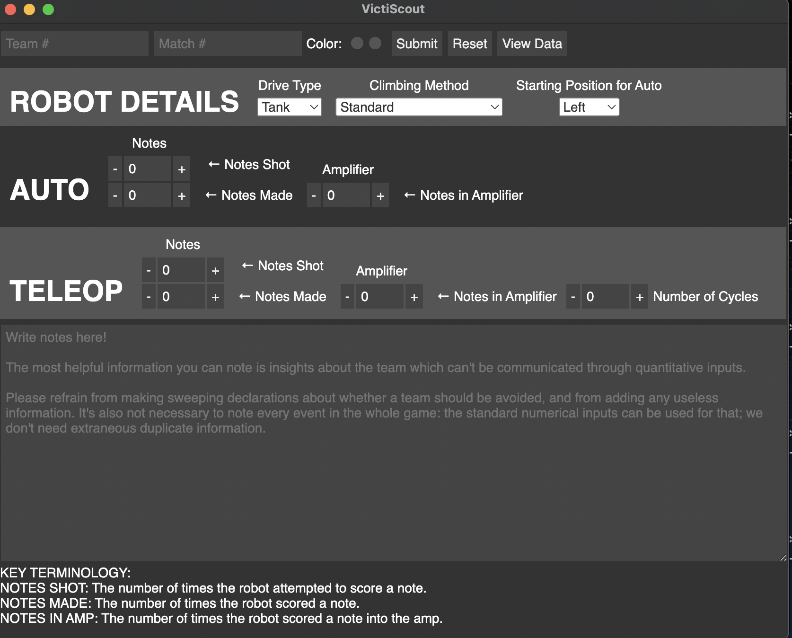

Application for FRC scouting. Written using [Electron](http://electron.atom.io/) for easy customization.

Get the newest compiled version [here](https://github.com/frc1418/VictiScout/releases)!

## Development dependencies
* [Node.js](https://nodejs.org)
* [npm](https://npmjs.com)

## Development Installation
1. `cd` into `VictiScout` directory
2. Run `npm install` to install node dependencies.

## Usage in Development
While in `VictiScout` directory, run

    npm start

### Transferring Data
The flow for using the Transfer Data window is as follows
1. Team members will combine any scouting data files on their computers into a CSV using the combine files section of the data page.
2. In the transfer data section, one member will select the "Hub Device" checkbox and provide an output directory for received files in the box below.
3. All other team members will select the CSV file they created in step 1 using their input box.
4. The team member with the "Hub Device" should go down the list of available devices and select "Receive" on each until all of them say "Received."
5. Then, the team member with the "Hub Device" will return to the data page to combine all received CSV files into one using the combine files section.

## Packaging
While in `VictiScout` directory, run

    npm run-script package-mac
    npm run-script package-win
    npm run-script package-linux

Choose the suffix appropriate for your target OS.

See [here](https://github.com/electron-userland/electron-packager#readme) for an explanation of how to modify your packaging settings.

## Authors
This software was created by [Erik Boesen](https://github.com/ErikBoesen) for [Team 1418](https://github.com/frc1418). See [Contributors](https://github.com/frc1418/VictiScout/graphs/contributors) for further information.

## License
VictiScout is available under the [MIT License](LICENSE).
