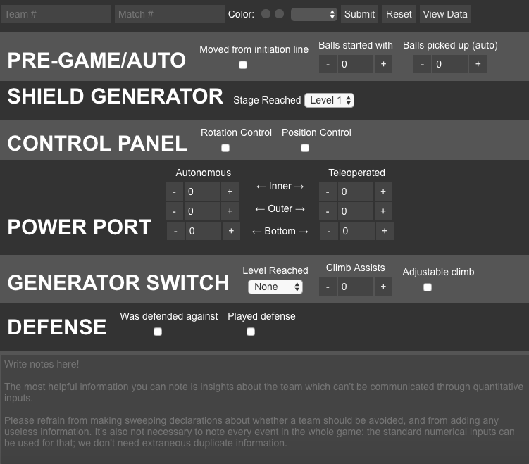

Aplikaĵo por la skoltanto de FRC. Skribita uzanta [Electron](http://electron.atom.io/) por facila agordo.

Prenu la plej nova version [ĉi tie](https://github.com/frc1418/VictiScout/releases)!

## Disvolvada dependeco
* [Node.js](https://nodejs.org)
* [npm](https://npmjs.com)

## Disvolvada instalaĵo
1. `cd` al la `VictiScout` dosieraro
2. Kuru `npm install` por instali la `Node` dependecon.

## Uzado en la disvolvado
Kiam en la dosieraro `VictiScout`, kuru

    npm start

## Pakaĵi
Kiam en la dosieraro `VictiScout`, kuru

    npm run-script package

Se vi volas pakaĵi por nur unu operaciumo, aligu `-mac`, `-win`, aŭ `-linux` al la fino de `package`. Alikaze, pakaĵi kreos por ĉiuj operaciumoj.

Vidu [ĉi tie](https://github.com/electron-userland/electron-packager#readme) por ekspliko de modifi viajn pakaĵajn agordojn.

## Verkintoj
Tiu programaro origine estis skribita por [Erik Boesen](https://github.com/ErikBoesen), por [Team 1418](https://github.com/frc1418). La traduko en Esperanto estis farita per [Erik Boesen](https://github.com/ErikBoesen) kaj [Paulo Costa](https://github.com/pauloca). [Vidi aliajn kontribuantojn](https://github.com/frc1418/VictiScout/graphs/contributors)

## Permesilo
Tiu programaro estas licencita je la [Permesilo MIT](LICENSE).
