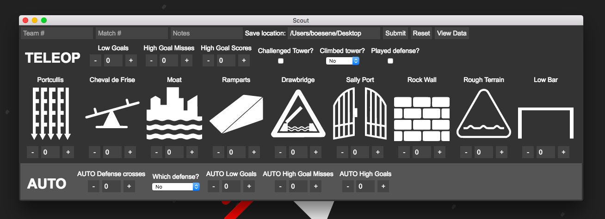

# VictiScout
Aplicación por exploración en la Competencia de Robótica FIRST. Escrito con [Electron](http://electron.atom.io/) por customización facil.

¡Descargue la versión mas nueva [aquí](https://github.com/frc1418/VictiScout/releases)!

Se puede descargar `vs`, una app para controlar datos de VictiScout, [aquí](https://github.com/frc1418/vs).

## Dependencias por desarrollar
* [Node.js](https://nodejs.org)
* [npm](https://npmjs.com)

## Instalación por desarrollar
1. `cd` al directorio `VictiScout`
2. Ejecute `npm install` para instalar las dependencias del Node.

## Marchar en desarrollo
Mientras está en el directorio `VictiScout`, ejecute

    npm start

## Embalaje
Mientras está en el directorio `VictiScout`, ejecute

    npm run-script package-mac
    npm run-script package-win
    npm run-script package-linux

Seleccione el sufijo apropiado por tú SO.

[Aquí](https://github.com/electron-userland/electron-packager#readme) hay una explicación de modificar sus preferencias de embalaje.

## Autores
Esto software fue creado por [Erik Boesen](https://github.com/ErikBoesen) para [Team 1418](https://github.com/frc1418). Vea [Colaboradores](https://github.com/frc1418/VictiScout/graphs/contributors) si quiere mas información.

## Licencia
VictiScout está disponsible debajo de la [Licencia MIT](LICENSE).
